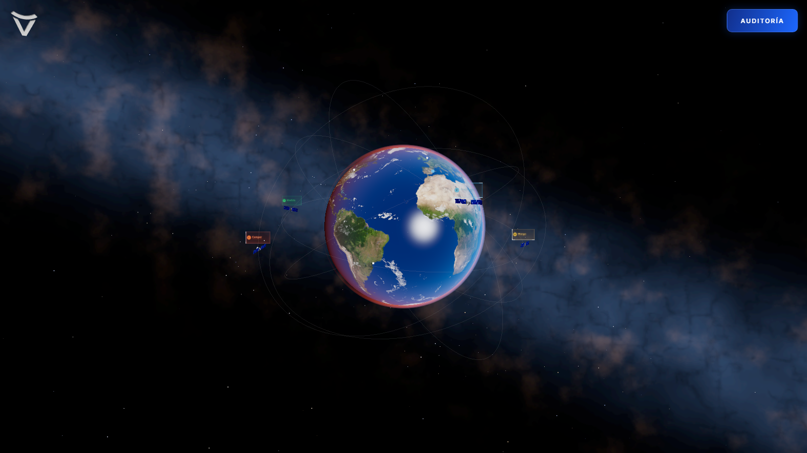

# Decisions

Why this project is built the way it is. Read the orientation section first — it
explains how the pieces fit together. Everything below it is the reasoning, in
date order.

**Append to this file whenever a significant decision is made. Do not rewrite
history.** If a decision is reversed, add a new entry saying so and why; leave
the original in place.

---

## Orientation — how this works

This prototype plays a single ~16 second opening sequence and then rests. The
end state is the Earth at its rest distance, the 3D brand isotype idling in the
top-left corner, and six satellites orbiting.

```
P0  draw       the isotype is drawn stroke by stroke, a dot riding the tip   ~5.5s
P1  shrink     the drawn mark scales down toward the centre                  ~0.8s
P2  warp       camera dolly through a starfield; the Earth cuts in midway    ~2.6s
P3  swap       the 2D mark collapses to zero as the 3D model blooms from it  ~0.7s
P4  corner     the 3D isotype spins 360° at centre, then flies to the corner ~2.15s
P5  orbits     six orbits draw in, each led by a glowing head; satellites    ~3.45s
               emerge — starts as the logo departs centre, overlapping its flight
```

Four things carry the whole design, and most of the code makes sense only once
you know them:

**One clock.** A single paused GSAP timeline in `useMasterTimeline` owns all of
time. Labels on it (`draw`, `shrink`, `warp`, `swap`, `corner`, `orbits`,
`site`) double as debug seek targets. The single documented exception is endless
ambient motion — Earth spin, logo idle, satellite orbiting — which runs on
`useFrame` delta; the timeline owns when those *start*, not their heartbeat.

**Continuous values never touch React.** The timeline writes into a plain
mutable object (`sequenceState.ts`) that the render loop reads. React state
holds only the current phase name. This is deliberate and load-bearing — see the
entry below.

**Phase checks are ordered, never listed.** Use `atOrAfter(phase, mark)`. A
hardcoded phase list silently broke the camera when `orbits` was inserted.

**The camera has exactly one owner at a time.** `CameraController` drives every
intro phase; at `site` it stops writing and the interaction rig in
`InteractionLayer` takes over for good. Two writers per frame is the failure the
source project removed OrbitControls to avoid — never add a second.

**Five isolated layers**, stacked by z-index, each owning its own surface:

| z | Layer | Surface |
|---|---|---|
| 10 | Earth, starfield, orbits, dolly camera | R3F `<Canvas>` |
| 15 | Geo-marker hover tags | `CSS2DRenderer` DOM overlay |
| 20 | The 2D isotype being drawn | DOM `<svg>` |
| 30 | The 3D isotype | its own `<canvas>` + renderer |
| 40 | Warp / swap flash | DOM `<div>` |

**Nothing ever cross-fades.** Both moments where one thing becomes another — the
starfield becoming the Earth, and the 2D mark becoming the 3D model — are hard
substitutions timed to a concealment beat. This is the single most important
visual principle in the project.

The work derives from two sibling prototypes, analysed in
`docs/extractions/001` (`earth-connections`) and `docs/extractions/002`
(`dolly-earth`). `docs/plans/002` is the implementation plan and
`docs/reports/002` records what actually happened.

---

## 2026-07-20 — Scope: the sequence ends at Earth + corner logo

> **Superseded 2026-07-20 by "the orbit system is in" below.** The predictions
> this entry makes all held, so it is kept as written rather than edited.

The satellite / orbit system from `earth-connections` (six drawn orbits, badges,
connectivity cloud, geo-markers) is deliberately **not** implemented yet.

It is a ~3.45s reveal with its own staggered internal timing. Folding it in
before the warp existed would have meant tuning it against a moving target. Two
things are preserved so it can be added later without rework:

- `EarthScene` rotates only the Earth *mesh*, never the enclosing group, so an
  orbit system can be added as a scene-level sibling. `OrbitSystem` must sit at
  scene level or orbital motion compounds with surface rotation.
- The Earth sphere stays at radius 2. `earth-connections`' orbit presets assume
  radius 1, so the future orbit group takes `scale={2}` rather than a rewrite of
  every preset.

When it is added: do **not** start the satellites at the same instant as the
corner flight. Both are ~3.4s and both are focal, so the eye will track the large
spinning logo and miss the orbits drawing in. Start them as the logo departs
centre, so attention hands off rather than competes.

## 2026-07-20 — React 19 + R3F 9, to port `dolly-earth` verbatim

The project was React 18 with GSAP and no 3D. `@react-three/fiber@9` requires
React 19.

Alternatives were staying on React 18 with R3F 8 (every ported file would need
review against a different major version) or writing the Earth in vanilla
three.js like `earth-connections` (a hand rewrite of `EarthScene` and
`CameraController`). Upgrading was cheapest: it let `EarthScene`,
`CameraController`, `MotionBlurPass`, `utils/easing.ts` and the four GLSL
shaders come across essentially unchanged, which is the bulk of the new code.

Consequence, and it bit immediately: React 19's `useRef<T>(null)` returns
`RefObject<T | null>` rather than `RefObject<T>`. Every ref-holding interface in
this project is therefore nullable and guards on `.current`.

## 2026-07-20 — GSAP is the single clock

The three source prototypes each time themselves differently: ours drove GSAP,
`dolly-earth` drove a bare `requestAnimationFrame` loop, `earth-connections`
drove an accumulating `phaseT` switch statement. Porting them naively would have
produced three independent clocks that drift apart within a second.

GSAP won because it was already here, and because `.seek()`, `.timeScale()` and
labels are exactly what an 11-phase-boundary sequence needs while it is being
tuned.

R3F reads GSAP's output rather than the reverse: GSAP tweens a proxy object,
writes the value into `sequenceState`, and `useFrame` reads it.

The warp tween uses `ease: 'none'` **on purpose**. Its shaping lives entirely in
`cinematicTravel` / `cinematicSpeed` / `narrowPeak`; a GSAP ease on top would
compound with them and destroy the width relationship between the three curves.

## 2026-07-20 — Continuous state is mutable and outside React

`dolly-earth` calls `setProgress` inside its rAF loop and `setState` again from
`useFrame` — two full re-renders per frame for 2.6 seconds. That is tolerable
with a four-component tree. Ours additionally mounts an SVG layer, a second
canvas and a debug panel with ~30 sliders.

So: **`useState` only for discrete phase changes.** Warp progress, swap
progress, overlay opacity and blur amount all live in `sequenceState.ts`, are
mutated in place, and are applied by direct DOM or three.js writes.

The overlay has two independent contributors (the warp cut and the swap flash).
They never overlap in time, but the applied value is `max()` of both so neither
can clobber the other at a boundary. `CameraController` is the single DOM writer
for it, inside `useFrame`, so it costs no additional loop.

## 2026-07-20 — No particle burst; a scale-through-zero crossover instead

`earth-connections` hides its 2D→3D substitution behind a Canvas-2D burst of
~1200 particles. **We decided against particles for this project.** The
principle it implements — hard substitution, never a cross-fade — is kept; the
mechanism is not.

The replacement: the 2D mark scales to zero at a point (`power2.in`) while the
3D model scales up from zero at the same point (`power2.out`), with the
substitution at the crossing. Rather than concealing the moment behind noise, it
removes the frame in which a comparison is possible. A narrow overlay flash,
reusing the warp's `narrowPeak` curve, supplies the beat the burst provided.

This turned out to be *better*, not merely cheaper:

- The burst was the reason the source has to solve silhouette matching at all.
  With nothing visible at the crossing, the model's start rotation became a free
  choice and the calibration task disappeared.
- `shrinkTargetSize` no longer has to approximate the 3D model's apparent size,
  since neither is visible at the crossing. It is a free aesthetic choice.

The cost, which required a specific mitigation: a burst would have covered ~1s
of a missing model, whereas a zero-crossing covers nothing — it would leave a
blank screen. The crossover is therefore **conditional on the model being ready**
and holds the 2D mark at full size otherwise, rather than collapsing it into an
empty frame.

If the crossover ever needs more weight, escalate in this order before
reconsidering particles: widen the flash; add one additive bloom sprite on the
corner-logo canvas; hold a small non-zero afterimage damp across the crossing
(that last one requires the model to be rendered by the composer, which it is
not — a real architectural change, not a tweak).

## 2026-07-20 — The warp: two unrelated legs and a concealed cut

The camera never travels the distance it appears to. Leg 1 pushes forward
through the star volume; leg 2 arrives from far out and settles at the Earth.
The camera is at `[0,0,-200]` on the last frame of leg 1 and `[0,0,80]` on the
first frame of leg 2. **That teleport is the transition.**

One progress value is read through three curves with deliberately nested widths:

| Curve | Drives | Width |
|---|---|---|
| `cinematicTravel(p, 1.7)` | camera position | full |
| `cinematicSpeed(p, cut, 0.34)` | FOV surge + motion blur | ±0.34 |
| `narrowPeak(p, cut, 0.1)` | black overlay | ±0.10 |

The blur ramps over a wide window so acceleration feels gradual; the overlay
spikes over a narrow one so it reads as a flicker rather than a fade to black.

The FOV surge (45°→68°) is the primary warp signal — a dolly zoom run in the
direction that amplifies motion instead of cancelling it, so peripheral geometry
stretches and rushes past the frame edges.

**The cut keys off raw progress, not the eased travel curve.** Scene visibility
and the overlay peak both compare `warpProgress` directly against
`sceneSwapProgress`, so they stay locked together even if the position easing is
retuned later. They agree with the position split today only because
`cinematicTravel` happens to be symmetric — do not rely on that.

## 2026-07-20 — A starfield exists because we have no city

In `dolly-earth`, leg 1 flies away from a city full of geometry. That geometry
*is* the motion cue, and it is what the blur pass operates on.

We have nothing there. Ported literally, our leg 1 would be a black screen with
a widening FOV — the surge has no parallax to act on and the composer has
nothing to smear. The starfield (one `THREE.Points` cloud, one draw call) is the
minimum that fixes both. It is not decoration; without it the warp does not read.

## 2026-07-20 — The SVG fakes its own motion blur

`AfterimagePass` operates on the WebGL framebuffer. The isotype is a DOM `<svg>`
above that canvas, so it receives none of the blur and would sit pin-sharp
through the most violent part of the warp.

It therefore drives a CSS `blur()` and a small outward `scale()` from the *same*
`cinematicSpeed` factor that feeds the composer. Because that factor is a bell
curve, both return to zero on their own by the end of the warp.

## 2026-07-20 — `MotionBlurPass` owns rendering

`useFrame(..., 1)` — the positive priority hands rendering to this callback and
R3F stops calling `gl.render()` itself.

**This callback must render on every frame, unconditionally.** An early return
here produces a blank canvas, not merely a missing effect. The `enabled`-style
guard present in the `dolly-earth` original was removed for exactly this reason.

The soft reset (`amount <= 0.001 → damp = 0`) matters too: an accumulation
buffer left at a non-zero damp holds a ghost of the last frame indefinitely once
the warp ends.

## 2026-07-20 — The drawing phase is the loading screen

P0 is ~5.5s of full-screen cover, which is a generous window for three Earth
JPEGs and a Draco-compressed GLB. So there is no progress bar — the draw *is*
the wait.

A gate between P0 and P1 pauses the timeline if assets are still in flight.
Holding on the finished drawing reads as a deliberate beat rather than a hang.
The gate has a 10s ceiling, after which the sequence proceeds degraded rather
than stalling forever, with the crossover guard keeping the 2D mark on screen.

Both readiness signals are gated, for different reasons: without the model the
crossover has nothing to substitute into, and without the Earth textures the
warp's cut would reveal an unshaded black sphere.

## 2026-07-20 — The 3D logo gets its own renderer

The corner logo is not part of the Earth `<Canvas>`. It owns a transparent
canvas, its own renderer, scene and camera, and its own rAF loop.

`earth-connections` reached the same conclusion after its source prototype used
a HUD scene with `clearDepth()`. A dedicated renderer gives the same depth
isolation and additionally guarantees the two cameras can never affect each
other. A second WebGL context is cheap at this scale.

`cornerFramePadding` does double duty and should be understood before it is
tuned: pulling the camera back and keeping the FOV flattens the frustum toward
orthographic, which is what makes the pixel-margin → world-unit corner mapping a
stable linear one. Lowering it does not just enlarge the logo, it degrades that
mapping.

`cornerMarginX/Y` measure to the logo's **centre**, not its edge. The value
inherited from `earth-connections` (80px, paired with their framing) put the
logo partly off-screen here; 48px with `cornerFramePadding: 20` lands a ~44px
logo where the previous static HUD isotype sat. The corner target is recomputed
every frame while idling, so a window resize re-anchors it with no resize
handler.

## 2026-07-20 — Debug overlay over `lil-gui` + localStorage

`dolly-earth` persists tuning to `localStorage` behind a `?gui=1` flag. We
extended the existing in-app `DebugOverlay` instead: sections per phase,
jump-to-phase buttons bound to the GSAP labels, and a scrub slider bound to
`timeline.progress()`.

The two navigation controls are not a nicety. With a 13s sequence, waiting ~10s
to re-check a corner-flight tweak is untenable, and every parameter added since
has been tuned through them.

No persistence: config is deliberately ephemeral so every reload starts from the
committed defaults, which are the source of truth.

## 2026-07-20 — Two traps found during verification

Both only surface at runtime, so they are recorded here rather than left to be
rediscovered.

**GSAP `seek()` suppresses callbacks by default.** Escape-to-skip and the debug
phase buttons appeared dead: the timeline moved but every `setPhase()` `.call()`
was skipped. Fixed with `tl.seek(label, false)`. Because that now fires all
callbacks between the current position and the target, `handleSeek` also has to
reconcile the imperative state that tweens cannot rewind — SVG visibility,
filter and transform, plus the corner logo's pose.

**The intro layer must stay mounted.** It was conditionally unmounted at
`phase === 'site'`, which nulled `svgRef.current`. The master timeline bails
early without an SVG, so Replay bumped the key but the effect could never
rebuild — the phase stuck at `site` permanently. The layer is now always mounted
and the mark's visibility is driven imperatively.

The second one only appears on a *second* run. Any future verification pass
should include a replay, not just a first play-through.

## 2026-07-20 — CSS presentation attributes lose to stylesheet rules

Recorded because it cost a debugging session and is easy to repeat.

An earlier attempt to resize the intro SVG set `width`/`height` **attributes** on
the `<svg>`. Those are *presentation attributes*, which sit at the bottom of the
cascade — below any author stylesheet rule — so the existing `.intro-svg` class
rule won outright and the change did nothing.

Sizing now flows through a `--intro-size` custom property set inline (inline
styles beat class rules), consumed by the class rule. Anything that needs to
override a stylesheet from JS on an SVG should follow the same route.

## 2026-07-20 — Reduced motion and skip are part of the design

A 2.6s FOV surge with accumulation blur is exactly the motion that triggers
vestibular symptoms. Under `prefers-reduced-motion: reduce` the sequence fades
the filled isotype in, places the Earth at rest and snaps the logo straight to
its idle corner pose — no warp, no crossover, no flight.

Escape skips to the end state from any point. At ~13s this is not a courtesy;
a returning visitor needs a way out. If the sequence grows, the drawing phase is
the place to buy time back.

## 2026-07-20 — The drawing phase is the GPU warm-up window too

A frame-timing capture (plan 003 §1) found a **326.8ms stall on the exact frame
the Earth cuts in** mid-warp, and a 56.8ms stall at the swap crossover. Both
were first-render costs: three.js compiles shader programs and uploads textures
the first time an object is actually rendered, and both the Earth group and the
logo model sit at `visible = false` until the most timing-sensitive moments of
the sequence. Keeping both scenes mounted (extraction 002 §4) avoids
*re*compiles at the cut — it does not avoid the *first* compile, and it had
moved that cost to the worst possible frame.

The fix extends the "drawing phase is the loading screen" decision: decoded on
the CPU is not the same as resident on the GPU, so P0 now hides the GPU costs as
well as the network ones.

- `EarthScene` uploads the three 4096×2048 textures with `gl.initTexture()` —
  **one per frame**, because each upload+mipmap costs tens of ms and the draw
  animation is live behind it — then runs `gl.compileAsync(scene, camera)` so
  programs link off the critical path (`KHR_parallel_shader_compile`).
- `createCornerLogo` does the same on **its own renderer** inside
  `assembleIfReady()`. This is not duplication: programs and textures are
  per-WebGL-context, so the main canvas's warm-up cannot reach the logo's
  context. Skipping this would leave the crossover stall intact.

Two things worth knowing before touching this code:

**`compile()` reaches invisible objects.** It collects materials with
`scene.traverse` (only *lights* are gathered via `traverseVisible`), so the
hidden Earth group and logo model are compiled without any visibility toggling.
No warm-up frame or 1×1 scissor trick is needed — plan 003 §3.3's fallback was
never required.

**The readiness flags changed meaning.** `state.earthReady` and
`state.modelReady` are now set only after warm-up *completes*, not when the
files decode. The P0→P1 asset gate therefore waits for the GPU to actually be
ready, which is the point — a gate that opens on decode would reintroduce the
stall. If compilation fails, both paths fall back to compile-on-first-render
rather than blocking the gate; the 10s gate ceiling still bounds the worst case.

Verification is the same capture as plan 003 §7: no frame above ~33ms anywhere
in the sequence. The star pop-in / dead-beat issue from the same plan (§2) is
choreography, not performance, and remains open.

## 2026-07-20 — The orbit system is in; `satellite-focus` is not

The full `orbit-system` folder from `earth-connections` is ported: six orbit
lines with a glowing head riding the growing tip, six satellite badges, the
connectivity cloud, and the geo-markers with their hover tags. It runs as a new
`orbits` phase, making the sequence six phases and ~16s.

**`satellite-focus` is deliberately not ported.** That is a different feature in
a different folder — click a satellite, fly the camera to it, open a case-study
panel. It is an *interaction*, not part of the opening sequence, and it wants
camera control that `CameraController` currently owns outright (the camera pose
is reasserted every frame, so an external system cannot move it). Porting it
means first deciding how camera ownership is handed over. `createOrbitSystem`
already exposes the API that feature needs — `satellites`, `isSatelliteActive`,
`freezeSatellite`, `resumeSatellite`, `setSatelliteHighlight` — so the ground is
prepared, but the decision is not made.

Every prediction in the superseded scope entry above held, and made the port
cheap: the scene-level placement and the `scale=2` reconciliation both worked
first time.

### The reveal starts when the logo departs, not when it arrives

The earlier entry warned against running the orbit reveal simultaneously with
the corner flight. That is now enforced by the timeline's structure: the corner
phase holds only through the pause and the spin, then the `orbits` label fires
as the logo begins its flight. `orbitsStartOffset` (default 0) can push it later
but not earlier — the handoff is a floor, not a suggestion.

The rhyme is the point. The orbit draw-in uses a glowing head riding a growing
line, which is exactly the visual language of the opening SVG draw where a dot
rides the stroke. The sequence opens with one line being drawn by a point of
light and closes with six. That only reads if the orbits get clean visual space.

### Ambient motion runs on its own accumulator, not the GSAP clock

The reveal's *start* is timeline-owned, but once satellites are orbiting they
keep orbiting after the timeline ends. `OrbitSystemLayer` therefore accumulates
its own elapsed time from `useFrame` delta rather than reading a tweened value.

This is a deliberate, narrow exception to "GSAP is the single clock", and it is
the pattern already established by the Earth's rotation and the corner logo's
idle float: **timed reveals are timeline-owned; endless ambient motion is not.**
The cost is that the reveal cannot be scrubbed backwards — seeking away from the
phase resets the system so the draw-in replays from the start instead.

### Phase comparisons must be ordered, never listed

Inserting `orbits` between `corner` and `site` broke `CameraController`, which
tested `phase === 'swap' || 'corner' || 'site'` to decide whether the camera sits
at the Earth. The new phase was not in that list, so the camera jumped back to
the starfield rest position and the Earth shrank to a dot for the entire reveal.
It typechecked and threw nothing; only a screenshot caught it.

All phase comparisons now go through `atOrAfter(phase, mark)` in
`sceneVisibility.ts`, which compares positions in `PHASE_ORDER`. **Do not
reintroduce a hardcoded phase list** — the next inserted phase will break it the
same silent way.

### Scale conventions are reconciled at the mount, not in the data

Every radius in `orbitConfig.ts` — orbit radii, cloud radius, marker radius and
sizes — stays in `earth-connections`' "Earth radius = 1" units. Our Earth is
radius 2, so both the orbit group and the geo-marker group mount with
`scale={EARTH_CONFIG.radius}`.

Rewriting the numbers would have been equally easy and considerably worse: the
presets stay diffable against the source project, so a future fix there can be
pulled across by eye.

### Geo markers live inside a new spin group

Markers label geography, so they must travel with the surface — but the orbit
system must *not*. `EarthScene` now has an inner `spinRef` group holding the
Earth mesh plus the markers, and that group is what rotates. The atmosphere
stays outside it (it is a uniform shell, so rotating it would be wasted work)
and the orbit system stays at scene level entirely.

### CSS2D is a second renderer, ordered after the composer

The hover tags use `CSS2DRenderer`, which is a DOM overlay with its own render
call. It runs at `useFrame` priority 2 so it lands after `MotionBlurPass`
(priority 1), which owns the WebGL render. Its layer sits at `z-index: 15` —
above the scene canvas, below the 3D logo.

Hover is disabled until the `orbits` phase. During the warp the camera is moving
at speed and tags over a warping globe look broken, quite apart from hover being
meaningless there.

## 2026-07-20 — The interactive phase: one camera owner, handed over at `site`

`satellite-focus` is now ported: drag to orbit the Earth, wheel to zoom, click a
satellite to fly the camera to a close-up with its case panel. Analysis in
`docs/extractions/003`.

### Ownership is handed over, not shared

`earth-connections` deleted OrbitControls to build this, and says why in a
header comment: *"a second camera owner would fight it every frame."* Its rig is
the only thing that touches the camera — every behaviour writes a `target`, and
one exponential lerp moves `current` toward it.

We had the same problem in a different shape: `CameraController` reasserts a rest
pose **every frame** so an interrupted or seeked timeline cannot strand the
camera. Running the rig alongside it would produce exactly the fight the source
avoided.

So the camera is handed over rather than shared. `CameraController` owns every
intro phase and returns early at `site`; the rig activates there and owns the
camera from then on. `CameraController` still owns every phase that can be
seeked, which is what its per-frame reassert existed to protect.

**The rig seeds from the known overview pose (`EARTH_REST`), not from
`camera.position`.** This is not a stylistic choice and it cost two debugging
rounds. On the natural path the camera is already there, so seeding from the
constant is jump-free. On a *skip*, `CameraController` bails before it ever moves
the camera off the starfield position — seeding from live stranded the rig at
z=200 with the Earth rendered as a dot. The first fix corrected the position
copies but left `syncOrbitTo(camera.position)`, and since `updateOrbitTarget()`
rebuilds the target from the spherical radius every frame, the stale 200 came
straight back. Both the pose *and* the spherical seed must come from the
overview.

### One smoothing mechanism, and one refinement that is invisible until wrong

`alpha = 1 - exp(-k·delta)` with `k = 3` — frame-rate independent, never
overshoots, no tween library, ~95% of the distance in ~1s. Delta is clamped to
0.1s so a backgrounded tab cannot teleport the camera.

In overview mode, **direction and radius are eased separately**:

```ts
const easedRadius = THREE.MathUtils.lerp(current.position.length(), orbit.radius, alpha)
current.position.lerp(target.position, alpha).setLength(easedRadius)
```

A plain Cartesian lerp between two points on the orbit sphere cuts through the
chord, so while dragging, the camera lags angularly *and sinks below the orbit
radius* — it visibly zooms in and out as you pan. Re-projecting onto an
independently eased radius keeps panning distance-stable. The close-up branch
deliberately does **not** re-project, because there the radius change is the
point.

### Framing is done by offsetting the look-at, not the camera

The close-up backs off along the Earth→satellite direction (Earth is at the
origin, so `normalize(satPos)` is the outward radial), which keeps the planet as
the backdrop. Then it shifts the **look-at** to the camera's right, which pushes
the satellite left of centre and clears the right side for the panel.

Moving the camera sideways instead would read as a dolly; moving the gaze reads
as a framing choice. This is a contract with the CSS: `closeUp.screenOffset` and
the panel's `width: min(420px, 38vw)` are tuned against each other, and changing
one means revisiting the other. Neither is aspect-ratio aware — on narrow
viewports the satellite drifts further off-centre.

### Scale lives in the config, not in rewritten literals

Like `orbitConfig`, `interactionConfig` keeps the source's "Earth radius = 1"
values and multiplies by `EARTH_CONFIG.radius` at definition. `zoomMin`/`zoomMax`
are expressed in Earth radii for the same reason.

### Cursor arbitration, because the source's approach is not actually correct

`earth-connections` has two hover systems (satellite badges, geo markers) both
writing `domElement.style.cursor`, and avoids thrash only by writing on change.
That still lets whichever writes last win, so the two can flip-flop where their
regions overlap.

`cursorManager.ts` replaces it: each source registers a request under its own key
and the highest-priority active one wins, with `drag` above `satellite` above
`marker`. One writer, deterministic outcome.

### Escape is overloaded, so the panel claims it first

Escape already skipped the intro. A viewer closing a case panel does not expect
that to restart anything, so the interaction controller takes Escape on the
capture phase when something is selected, and App's skip handler additionally
guards on `!selectedCase`. The explicit guard is what actually makes it correct;
the capture handler is belt and braces.

### Selection is React state; hover is not

Selection is a discrete event that drives DOM (the panel), so it lives in
`useState`. Hover is evaluated per frame — satellites move even when the pointer
is still — so it stays inside the controller and applies through
`setSatelliteHighlight` and the cursor manager. Same rule as everything else
here.

Closing the panel routes through `interactionRef.deselect()` rather than just
clearing state, because closing is a *deselect*: the camera returns to overview
and the satellite resumes its orbit from where it froze.

## 2026-07-20 — The space backdrop is a second field, on a shell

> **Partly superseded** by *2026-08-11 — The backdrop becomes a galaxy*. The shell, its
> radius, its gating and the two-field split below are all still current; the three-tier
> `Points` construction and the Fibonacci distribution are not.

Plan 004 is implemented as its option A. The resting scene no longer sits on
pure black.

### Two star fields, because one geometry cannot serve both jobs

`Starfield` stays exactly as it was: a dense near-field box, additive, size
attenuated, gated OFF at the warp's cut. It is the warp tunnel — the geometry the
FOV surge stretches and the afterimage pass smears. `SpaceBackdrop` is new: a far
shell, plain blending, **not** size attenuated, gated ON at the cut and never
removed.

The requirements are contradictory, which is the whole argument. The tunnel needs
near points to rush past the frame edges; the backdrop needs far points that can
never occlude the planet. Reusing one shell for both was rejected: at backdrop
distance nothing moves appreciably across a 400-unit travel, so the streaks would
collapse and the warp would lose most of its punch. The cost of two systems is
three extra draw calls of static geometry with no per-frame CPU.

### The shell is a guarantee, not a tuned constant

**Do not turn this back into a filled volume.** The naive fix — making
`starsVisible` return `true` after the cut — renders stars *in front of the
Earth*, because our box contains the origin and distributes points through the
gap between camera and planet.

If every star sits at radius `Rs` and the camera orbits inside at `Rc < Rs`
looking inward, no star can lie between camera and origin: the shell point along
the camera's own view ray is behind it, and every other one is off-axis. Measured
on the shipped defaults, the closest star is at 153 units against a `zoomMax` of
22 — 7× clearance. Radial jitter (±15%) is applied to the radius only, never to
the direction, so it cannot break that bound.

The invariant to preserve: **`backdropRadius` minus jitter must stay far above
`INTERACTION_CONFIG.camera.zoomMax`.** The debug slider's lower bound is 60 for
this reason. If zoom is ever retuned, this is the number to re-check.

### Three magnitude tiers, bucketed by hash and not by index range

A field of identical dots reads as noise. `PointsMaterial` has no per-point size,
so the sky is three `Points` objects at 1.0/1.6/2.6px carrying 70/25/5% of the
points.

Points are assigned to tiers by a deterministic per-index hash. **Not by
contiguous index ranges** — the Fibonacci spiral walks pole to pole, so slicing
it by range would band the sky by latitude and put every bright star in one
stripe. This was the one non-obvious part of the implementation.

`sizeAttenuation: false` is the setting that differs from both the tunnel and the
source project, and it is not optional: at 180 units an attenuated point collapses
to sub-pixel and vanishes.

### It appears in the same frame the Earth does

`backdropVisible` delegates to `earthVisible` rather than copying its condition,
so the two cannot drift apart. The backdrop therefore arrives under the overlay
flash and peak blur that already conceal that substitution — the established
"nothing ever cross-fades" principle applied to one more element. It is mounted
invisible from the first frame so the existing `compileAsync` warm-up covers its
materials; mounting it later would move a compile onto the cut, the worst frame
in the sequence.

The Fibonacci distribution function moved from `createConnectivityCloud` to
`utils/fibonacciSphere.ts` rather than being copied. The zero-jitter path is
numerically identical, so the cloud is unchanged.

## 2026-07-20 — Satellite content is typed sample data, and the type is shared

`SATELLITES` no longer holds its own "CASE 01" literals. `SatelliteDef` is now an
alias of `CaseStudy`, whose data lives in `src/data/caseStudies.ts`; orbitConfig
only decides which orbit each one rides. There is no second shape to keep in
sync, and `SATELLITES` is the single seam an API would replace.

**The sample data names real Spanish companies and every metric in it is
invented.** Mango, Cabify, Estrella Galicia, Idealista, Camper and Freixenet are
not clients and those results did not happen. The file says so at the top in
bold. This is fine for an internal prototype and is *not* fine to ship — attaching
fabricated results to a real company's name is a false endorsement claim, not a
rough draft. Replace before anything is published.

`.ts` over `.json` deliberately: `tsc -b` catches a mistyped field instead of
rendering `undefined` on a badge, and the array bundles with no fetch, parse or
loading state — which matters because `createOrbitSystem` builds its badges
synchronously at mount. Making the content async is the one real change an API
brings, and the readiness-gate pattern for it already exists.

Consequence, and the reason the badge texture changed: real brand names vary in
length where "CASE 01" did not, so `createPlaceholderLogoTexture` now measures
and shrinks to fit instead of hardcoding 15.5% of the canvas.

### The hover bump lives on an inner group

Satellites are bigger (`baseSize` 0.13 → 0.175) — they carry brand names now and
they are the only clickable thing in the scene, where at 0.13 they read as
decoration. Orbit `lineOpacity` went 0.05 → 0.09 for the same reason: at 0.05 the
completed paths all but vanish once their head glow fades.

Hover now scales the badge as well as brightening the rim, and that scale is
applied to a new **inner** group inside `createSatellite`. The outer group's
scale is rewritten every frame by the entrance animation in `createOrbitSystem`,
so a bump applied there is silently overwritten on the next frame. The outer
group remains the raycast and `lookAt` target, so no consumer sees the extra
level. `reset()` clears the highlight too, or a replay begun with the pointer
over a badge would re-run the entrance on an already-enlarged one.


---

## 2026-07-20 — Audit section (plan 005)

### The scene recomposition is a projection shift, not a camera move

Plan 005 asks that the scene subject re-centre inside the strip right of the
audit panel and be restored *exactly* on close. The camera pose already has two
owners that reassert it per frame — CameraController during the intro, the
focus rig at rest — so a third pose writer was never on the table.
`AuditCameraShift` instead animates `camera.setViewOffset()`, which slides the
projection window one level below the pose. Whoever owns the camera keeps every
behaviour (drag orbit, wheel zoom, warp FOV surge), and `clearViewOffset()` is
an exact restore by construction — there is no saved pose to drift. The shift
amount is derived from the panel's CSS width (`clamp(480px, 44vw, 720px)`), so
the subject lands at the centre of the visible strip rather than at an
arbitrary offset.

### The curtain is CSS, off the master timeline

The audit section can open during *any* phase — it is user-triggered UI, not a
beat in the intro — so it does not belong on the single GSAP clock. It follows
the SequenceState idiom instead: `auditView` is a mutable module singleton the
DOM UI writes and the render loop reads, and all DOM motion is CSS transitions
keyed off a four-state machine (`closed / entering / open / leaving`) with the
trigger disabled mid-transition. The canvas stays full-screen and never
resizes; the panel is an overlay (plan 005 §15's preferred option).

### While the audit is open, satellite selection is off but the rig stays on

Deactivating the rig would snap it back to the overview pose on reopen, losing
the user's drag position — so it stays active and the visible strip keeps its
ambient drag. Only `focus.setEnabled(false)`: a satellite close-up's
composition contract (`closeUp.screenOffset` clearing space for the case panel)
assumes the full viewport and would fight the audit layout. Opening the audit
also deselects any focused satellite for the same reason.

## 2026-07-20 — Case panel recomposed: the camera backs off, the panel moves in

The close-up composition read as edge-hugging: the panel sat at `right: 5vw`
and the focused badge filled ~25% of the viewport height. Two changes, one
number each.

**The satellite got smaller by raising `closeUp.distance` (1.0R → 1.35R), not
by resizing the badge.** Backing the camera off shrinks the focused badge to
~19% of viewport height while leaving the overview scene untouched — the badge
geometry, its raycast target and the orbit composition never change. It has a
side effect worth knowing: `screenOffset` is a world-space look-at shift, so a
longer camera distance shrinks its *angular* effect and the satellite drifts
toward centre. Here that works with the goal rather than against it — the whole
composition was meant to move centreward — but anyone raising the distance
further should re-check the satellite/panel clearance rather than assume the
offset still holds.

**The panel moved from `right: 5vw` to `right: 11vw`.** Width is unchanged, so
the documented contract between `closeUp.screenOffset` and the panel width
stands. Checked at the new geometry (45° vFOV, 16:9): the badge spans roughly
30–40% of screen width, the panel's left edge sits at ~67% — clear by a wide
margin.

Related, and previously unrecorded: two values the "hover bump" entry above
describes as raised have since been reverted to the source's numbers — badge
`baseSize` is 0.10 again (not 0.175) and orbit `lineOpacity` is 0.05 (not
0.09). The `baseSize` comment carries the new reasoning: the badges are meant
to read as small orbiting markers, not as the focus — the close-up distance
change applies the same principle from the other side, letting the framing do
the enlarging when a badge *is* the focus. The `lineOpacity` comment in
`orbitConfig.ts` had gone stale during the revert (it described the raise over
the reverted value) and has been corrected to record 0.09 as the tested
fallback if the paths ever need to read stronger.

## 2026-07-20 — Case panel charts are hand-rolled SVG, and the data owns the shape

The "Gráfica próximamente" placeholder is now a real chart, plus four bullet
lines of body copy per case.

### No charting library

Four fixed chart types (line, bars, area, donut) over at most twelve static
points do not justify a dependency. `CaseChart.tsx` renders plain inline SVG,
which keeps the panel's monochrome glass styling where the rest of it lives —
in CSS, as white at varying opacities. The donut differentiates segments by
*opacity*, not hue, for the same reason: the panel has no colour language to
borrow from.

### The data file decides the chart; the renderer only normalizes

Each `CaseStudy` gained a `chart` field (`type`, `title`, `values`, optional
`labels`) and a `details` array. The renderer normalizes every series to its
own min/max, so the data can use any units and only the shape matters — chart
data is content, and it lives in `caseStudies.ts` under the same
placeholder-data disclaimer as everything else there. The invented series must
be replaced along with the invented metrics before anything ships.

### The height-reservation pattern extends to the new blocks

The panel stays mounted through its fade and fields fall back rather than
unmount, so anything that changes height mid-fade makes the panel jump. The
details list reserves its block with `min-height`; the graph container has a
fixed height whether or not a chart is mounted. Same rule as the existing
`min-height` on the title, meta and description — new content blocks in this
panel must reserve their space.

## 2026-07-20 — The debug panel lives at `/debug`, not behind a toggle

The `DebugOverlay` used to mount on every load, with only its expand toggle
keeping it out of the way. That made every viewing a *debug* viewing — there was
no way to see the site as a visitor would.

It is now gated on the URL path: `App` reads `window.location.pathname` once
into a module-level `DEBUG_MODE` constant, and the overlay only mounts when the
path is `/debug` (trailing slashes tolerated). The root URL renders the site
with no tuning chrome at all; `http://localhost:5173/debug` is the same build
with the panel, which now starts **open** — navigating there is already the
statement of intent the old toggle asked for. The toggle remains to collapse it.

No router was added. Vite's dev server falls back to `index.html` for any path,
which is all this needs. Two consequences to remember:

- The flag is read **once**, at module load. Switching between the two views is
  a full page navigation, which is fine — replays start from committed defaults
  anyway (see the "no persistence" decision above).
- A production build on a static host would 404 on `/debug` without an SPA
  fallback. That is acceptable — arguably a feature — but if the panel is ever
  needed against a production build, the host needs the rewrite rule.

## 2026-07-20 — No interaction chrome until the sequence lands

The Auditoría trigger was visible from the first frame, floating over the
drawing, the warp and the half-built orbit reveal. The rule now: **the intro
offers no interactive UI until everything has arrived.**

The gate is `phase === 'site'`, passed into `AuditSection` as a `ready` prop,
and `site` is the right signal by construction rather than by tuning: the
timeline's orbits phase holds for `max(toCornerDuration, orbitRevealDuration())`
before the `site` label fires, so `site` *means* "last satellite drawn in, logo
parked". Deriving readiness from anything else (a timer, a separate flag) would
drift the moment the reveal is retuned; `orbitRevealDuration()` is already
derived from the stagger config for exactly this reason.

Details that matter:

- The button is **unmounted** before `site`, not hidden — nothing to focus, tab
  to, or read out. Mounting fresh is also what triggers its CSS entry animation
  (a 480ms fade-and-drop) exactly once, at the right moment, with no JS timing.
- Skip and reduced-motion both jump straight to `site`, so the button appears
  immediately there. Correct: skipping *is* completing the setup.
- The trigger stays mounted while the audit section is open even if `ready`
  drops — a debug replay rewinds the phase to `draw`, and the "Cerrar" control
  must not vanish under the user mid-use. The condition is
  `ready || phase !== 'closed'`.

If more interactive chrome is added later (nav, contact, language switch), it
should gate on the same prop-from-phase pattern, not on its own timer.

## 2026-07-20 — The audit panel's scrollbar is styled, and `.audit-panel` is the place

The audit form can overflow on short viewports, and the OS default scrollbar —
a wide grey gutter on Windows — broke the panel's black, accent-blue language.
It now has a 6px rounded thumb in the brand blue (`rgba(28, 103, 255, …)`, the
same family as the CTA and the curtain's edge line) on an invisible track, so it
reads as a position indicator rather than a control. Both engines are covered:
`::-webkit-scrollbar` rules for Chromium/Safari, `scrollbar-width: thin` +
`scrollbar-color` for Firefox.

The rules live on `.audit-panel` because that is the scroll container —
`.audit-form` merely fills it. Anyone restructuring the panel should keep the
scrollbar styles attached to whichever element actually owns `overflow-y`.

## 2026-07-20 — Audit close moved into the panel; the trigger no longer dual-roles

This reverses plan 005 §3's "one control, two roles" choice. The corner button
is now open-only: it fades out when the section opens, and closing lives on a
back arrow (left arrowhead, long trailing line) at the panel's top-left —
where the eye already is, pointing against the curtain's entry direction.

Three things must survive future edits:

- **The trigger fades, it does not unmount.** It is the focus-return target on
  close, and unmounting would replay its entry animation on every reopen. It is
  `disabled` in every non-closed phase so the invisible control cannot be
  clicked; focus-return is deferred one `requestAnimationFrame` because React
  has not re-enabled it yet inside the close timeout's callback.
- **The entry animation's fill mode is `backwards`, and that is load-bearing.**
  With `both`/`forwards` the keyframes' final `opacity: 1` applies forever and
  outranks the `[data-state]` fade-out rules — the trigger visibly never
  disappeared. Symptom to remember: a transition that "does nothing" on a
  property an animation once touched is usually a fill-mode fight.
- **The back arrow sits on the curtain, not the scrollable panel**, so it
  cannot scroll away; its `left` mirrors the form's padding clamp so it stays
  aligned with the content column. `close()` no-ops outside `open`, which is
  what makes mid-transition clicks safe without disabling it.

## 2026-07-21 — Satellite badges replaced by the GLB model; orientation decoupled from camera

The circular logo badges are gone: every orbit slot now renders
`public/models/satellite.glb`. The load happens once and is cloned per
satellite (shared geometry, cloned materials — each clone still fades in
independently during the entrance).

Decisions that must survive future edits:

- **The model's orientation never reads camera or selection state.** The old
  badges billboarded with `lookAt(camera)` every frame; kept for a 3D model,
  that made satellites visibly reorient during the focus fly-in/out. Instead a
  `spinner` group advances by per-frame delta only — a slow continuous
  self-rotation, seeded per satellite. Opening or closing the case panel
  therefore cannot produce any orientation jump: the model keeps turning while
  frozen, and on deselect it resumes its orbit path exactly where it was held
  (the existing freeze/resume progress carry-over).
- **`satellite.update(delta)` runs every visible frame, frozen or not.** The
  `frozen` flag only skips the orbital position write, never the spin.
- **Raycasting uses an invisible sphere, not the model's meshes.** The GLB is
  thin/spiky; hovering its real surface flickered the highlight. The sphere
  reuses `baseSize` (the old badge footprint) with `colorWrite: false`, so
  hover feel is unchanged.
- **Lights live inside the orbit group.** The scene had none (Earth is a
  shader, everything else unlit); the GLB's lit materials need an ambient +
  key directional. Nothing else in the scene responds to lights, so this is
  scoped by construction.
- The template is normalised to unit size, so
  `ORBIT_CONFIG.satellite.modelSize` is the single sizing knob;
  `modelSpinSpeed` is the rotation knob.

## 2026-07-21 — Follow-up: satellite.glb is Draco-compressed

Nothing rendered after the GLB switch: the file lists
`KHR_draco_mesh_compression` in `extensionsRequired`, so a bare GLTFLoader
rejects with "No DRACOLoader instance provided" — and the load promise had no
`.catch`, so the failure was silent. Two fixes, both load-bearing:

- GLTFLoader gets a DRACOLoader with `setDecoderPath('/draco/')`. The decoder
  files in `public/draco/` are copied from
  `node_modules/three/examples/jsm/libs/draco/gltf/` — re-copy them when
  upgrading three.
- The load now has a `.catch` that logs. A satellite that never appears must
  say why in the console.

## 2026-07-21 — Case panel exit: fade over the last contents, not an emptied shell

The close felt instantaneous even though a 220ms fade-out existed. Cause: the
panel renders from `data`, which goes null on the first frame of the exit — so
title, meta, details and chart all emptied immediately and the fade animated a
blank shell. The fix is not a new transition: the panel now keeps the last
selected case in a ref (`shown`) and renders content from it, while `data`
alone still drives visibility, aria-hidden and focusability. The exit
transition itself was lengthened slightly (340ms ease-out vs the 220ms entry)
so the close settles; the `visibility` flip delay must always match the exit
duration or the panel vanishes mid-fade.

## 2026-07-21 — Baked KTX2 textures are the material strategy; the bake owns the shading

`satellite.glb` rendered untextured. It now loads
`public/textures/satellite_Baked.ktx2` through `KTX2Loader`, reusing the Basis
transcoder in `public/libs/basis/` that `createCornerLogo` already ships. That
makes two consumers of the same setup, so this is now the project's texture
pattern rather than a one-off: **bake in the DCC tool, export KTX2 with
mipmaps, load with the shared transcoder.**

Four things must survive future edits:

- **The map is applied to the shared template, not per clone.** Satellites
  clone one loaded GLB, and `Material.clone()` copies the `.map` *reference* —
  so texturing the template before cloning gives six satellites one GPU
  texture. Applying it after cloning would work visually and waste six uploads.
- **`metalness = 0`, `roughness = 1`.** The bake already contains all the
  shading. Leaving the authored PBR response would light an already-lit
  texture, which is the same mistake in the same place the corner logo
  documents. This is the rule for every baked asset here.
- **`flipY = false`** — glTF UV convention; without it the bake lands mirrored.
- **The renderer must reach the loader.** `KTX2Loader.detectSupport(renderer)`
  picks the GPU's compressed format, so `gl` is now threaded
  `OrbitSystemLayer → createOrbitSystem → createSatellite`. It is optional at
  every step and the texture degrades to *untextured but present* if it is
  missing or the load fails — a texture failure must never cost the model.

`renderer.initTexture()` runs at load, extending the "drawing phase is the GPU
warm-up window" decision to this asset: the upload (mipmaps included) happens
during the intro, not on the frame the satellites fade in.

## 2026-07-21 — The custom cursor is a DOM layer with its own rAF, and it borrows the cursor manager

The native cursor is replaced by a white hand that follows the pointer exactly,
with a blue ring easing behind it. Three glyph states: **open hand** at rest,
**pointing hand** over anything clickable, **fist** while pressed or dragging.

Built as two `position: fixed` divs, not in the Three.js scene — the cursor has
to sit above the case panel, the audit curtain and the debug overlay, which are
all DOM. It is the first thing in the project that runs a rAF loop outside both
renderers, so the performance rules are explicit:

- **Transform-only writes, never React state.** The loop writes
  `translate3d` straight to `element.style` — compositor work, no layout, no
  re-render. `CustomCursor` renders exactly once and never again. This is the
  same "continuous values never touch React" rule the sequence state follows.
- **The loop stops when it settles.** Once the follower is within a fraction of
  a pixel of the pointer it cancels itself and re-arms on the next
  `pointermove`, so a still mouse costs nothing. Any future addition to this
  loop must preserve that exit.
- **Easing is `1 - exp(-k·dt)`** — the same frame-rate-independent form as the
  camera rig, for the same reason.
- **All visual state is CSS on data attributes.** Glyph swaps, hover grow and
  press shrink are keyed off `data-state` / `data-pressed`, applied to inner
  `-core` elements so a CSS transition never fights the per-frame transform on
  the wrapper. The hot path only ever writes a transform.

The hand glyphs are **inline SVG paths in the component**, not files in
`public/`. Nothing to fetch, nothing that can 404 mid-session, and they inherit
the stylesheet's white stroke language. Native `cursor: grab/grabbing` was
rejected despite being free: OS-rendered means no white styling, no sizing, and
no blue ring.

### `cursorManager` gained a second consumer, and `cursor: none` is why

The manager's priority arbitration (`drag` > `satellite` > `marker`) was
already correct and is unchanged — but its output was a native
`style.cursor` write, and the custom cursor sets `cursor: none` on everything,
which would have silently discarded it. It now **also** publishes the winning
state through `interaction/cursorSignal.ts`, a module-level pub/sub, and the
cursor component subscribes.

- The native write **stays** as the fallback for coarse pointers, where the
  custom cursor never mounts. Both paths are live; only one is visible.
- A module singleton rather than a prop: the manager lives inside
  `InteractionLayer` and the cursor mounts at the app root, so threading a ref
  through five components for one string would be ceremony. Subscribers get the
  current value immediately on subscribe, because the cursor mounts *after* the
  interaction layer and would otherwise miss the state.
- DOM hover (buttons, links) is read with a `closest()` check on the same
  `pointermove` that already runs; the 3D scene's hovers arrive through the
  signal. Two sources, one visual state.

Mounting is gated on `matchMedia('(pointer: fine)')` — on touch the custom
cursor is a dot stranded at the last tap. Under `prefers-reduced-motion` the
follower snaps instead of trailing: the look survives, the chase does not.

## 2026-07-21 — Reversed: the case-panel close-up moves back in (1.35R → 0.55R)

This reverses the "Case panel recomposed: the camera backs off" entry above,
and the reason is that its premise expired. That entry raised
`closeUp.distance` because a **flat circular badge** filled ~25% of viewport
height and read as oversized. The badges are gone — the satellite is now the
GLB model, which at the same distance reads far smaller and got lost against
the planet next to the panel. Distance is now `0.55 * R`; `screenOffset` came
down with it (0.26R → 0.16R).

The side effect that entry documented is exactly what forced the second change,
in the opposite direction: `screenOffset` is a world-space look-at shift, so a
*shorter* distance amplifies its angular effect and pushes the satellite too
far left. **These two values move together — changing one without re-checking
the other breaks the framing.** That coupling, and the one with the panel's CSS
width, is the durable fact here; the numbers themselves are taste.

`INTERACTION_CONFIG.closeUp.distance` in `src/interaction/interactionConfig.ts`
is the knob for this view. Smaller is closer.

(Unrelated tuning in the same pass, recorded so the `orbitConfig` comment is
not read as stale: orbit `lineOpacity` is now 0.02, down from 0.05. The comment
there still names 0.09 as the tested value if the paths ever need to read
stronger.)

## 2026-07-21 — Amendment: the cursor artwork is the designer's, still inlined

The placeholder glyphs I drew are replaced by the real icons, which arrived as
`public/icons/{open,close,pointer}-hand-icon.svg`. The delivery mechanism did
**not** change — the `d` attributes are pasted into `CustomCursor.tsx` and the
entry above still holds: a cursor that 404s or flashes on first hover leaves
the site with no visible pointer, which is worse than any staleness risk.

**The trap this creates, and the reason for this entry: `public/icons/*.svg` is
the design source of truth but is not read at runtime.** Redrawing those files
changes nothing on screen until the path data is re-pasted. Both the component
and the stylesheet say so at the point of use.

Two properties of the new artwork are load-bearing and must not be "cleaned up"
into a plain white silhouette:

- **White fill with a thin black outline.** That is what keeps the cursor
  legible over both the black starfield and the white case-panel glass. A
  white-only glyph disappears on the panel.
- **`fill-rule: nonzero`.** The finger divisions are same-direction subpaths.
  Under `evenodd` they punch holes and the hand renders shredded; under
  `nonzero` they fill solid and read via their stroke, as authored.

Each glyph also carries its own hotspot (`--hx`/`--hy`) rather than being
centred, because a hand's contact point is not its bounding-box centre — the
pointing hand registers at the fingertip, the open and closed hands across the
knuckles. They are kept within a few pixels of each other so the crossfade
reads as a swap and not a slide. The follower ring was deliberately left at its
approved size; the glyphs are sized to sit inside it.

## 2026-07-21 — Holographic brand panels: in-scene quads, drawn plates, frame-only holo

Each satellite now carries a floating panel showing its brand. The design goal
is specific and it drove every choice below: **the panel must pull the eye from
the Earth overview AND stay readable in the case-panel close-up.** It is not
constant screen size — it takes normal perspective — it just has to survive
both ends of that range.

### In the scene, not the DOM

A `CSS2DRenderer` panel (the geo-marker pattern) would be resolution-perfect at
any zoom, and was rejected anyway: DOM has no depth, so a panel would render on
top of the Earth while its satellite is behind it. The geo markers only get away
with it because they compute limb fade by hand. The in-scene quad gets correct
occlusion for free from `depthTest` — and `depthWrite: false` keeps it from
occluding anything itself or fighting the atmosphere shell for sort order.

### No Blender for a flat quad

The panel is `PlaneGeometry(1, 1)` created in code, shared by all six, with size
carried in `mesh.scale`. Routing two triangles through Blender would add a GLB
fetch and a Draco decode and would freeze the dimensions into an asset instead
of leaving them as `ORBIT_CONFIG.panel` knobs. **Blender only earns its place
here if the panel gains real geometry** — a bevelled frame, thickness,
curvature. Curvature alone does not qualify: `PlaneGeometry(w, h, 12, 1)` bent
in the vertex shader keeps it a tunable number.

### Billboarding is a scoped exception to the orientation rule

The panel faces the camera, which the satellite model deliberately never does
(see the GLB entry above — a model that reorients during the focus fly-in was
the exact problem that rule exists to prevent). This is not a reversal: the rule
protects the *model*, and an unreadable label has no purpose. The panel is a
separate object hung off `content`, never off `spinner`, so the model keeps
turning underneath a panel that stays upright.

It billboards **in the vertex shader**, not through `lookAt()`: the quad's
origin goes through the normal transform and its corners spread along the
camera's view-space axes. Zero per-frame CPU, no camera reads on the JS side.
The one subtlety is that discarding the model matrix's rotation also discards
its scale, so the shader recovers it from the matrix column lengths — otherwise
the orbit group's Earth-radius scale, the entrance growth and the hover bump all
silently stop applying.

### One atlas, and its aspect is coupled to the panel's

All six plates live in a single 2048×1536 `CanvasTexture` (2×3 cells of
1024×512); each panel samples its own cell through a UV offset/scale uniform, so
six panels cost one texture bind. Two couplings that will break quietly:

- **Cell aspect must match `panel.width / panel.height`.** Both are 2:1 today.
  Change one without the other and every plate stretches.
- Cell resolution is set by the *close-up*, not the overview. At
  `closeUp.distance` 0.55R the panel is the most magnified thing on screen; 512×256
  visibly softens there. Mipmaps and `ClampToEdgeWrapping` are required for the
  other end — without mipmaps the wordmark aliases into noise as the satellite
  orbits, and without clamping neighbouring cells bleed at the coarse mips.

### The plates are drawn, not real logos

> **Superseded 2026-08-11 — the seam described below is now implemented.** The plates are
> still drawn, but as the *floor* rather than the only state: real `logo` URLs load in the
> background and redraw their cell. The trademark reasoning here still stands and is why
> every `logo` is still `null`. `createPlaceholderLogoTexture` no longer exists — it had no
> callers left and was removed. See the amendment at the end of this file and
> `../DECISIONS.md` §18.

No trademark artwork is used, and `brandColor` in `caseStudies.ts` is decorative
rather than each company's real colour. Same reasoning as that file's existing
warning: real logos beside invented case-study results read as client
endorsement, which is a stronger claim than a name in a list. The generated
plate is also the established fallback here — it is what
`createPlaceholderLogoTexture` did for the old badges. **The seam for real
artwork is `drawPlate` in `createBrandAtlas.ts`**: swap the per-cell drawing for
a `drawImage` of a loaded SVG and the atlas layout, UV maths and shader are
untouched.

### The holo lives on the frame; the plate stays legible

Frame, corner brackets, edge bleed and flicker carry the effect. The plate
itself gets only travelling scanlines and light grain — no hue shift, no
displacement — because it is the one part that must stay readable, and a
flickering wordmark reads as broken rather than projected. The frame colour is
deliberately NOT the brand colour: the chrome is Vertigo's language, the plate
inside is the brand's.

### A raw ShaderMaterial gets no output colour conversion

Recorded because it will recur with every custom shader added to this project,
and because it fails as "looks a bit dark" rather than as an error. Built-in
materials append the output transform; a hand-written `ShaderMaterial` does not.
Everything in this shader is linear — the atlas is tagged `SRGBColorSpace` so
sampling linearises it, and `THREE.Color` converts hex literals on assignment —
so it must end with `#include <colorspace_fragment>`. Note the chunk was named
`encodings_fragment` before three r152; this project is on r174.

The panel geometry numbers (`width`, `offsetY`) were derived from frustum maths
rather than judged by eye, so they are the first thing to re-check visually.

## 2026-07-22 — Reversed: the drawing is *driven by* loading, not merely during it

Plan 006, **implemented** (phases 1-4; the Earth-texture KTX2 conversion is not
done). Reverses the **mechanism** of "2026-07-20 — The drawing phase is the
loading screen" and "2026-07-20 — The drawing phase is the GPU warm-up window
too" while keeping their intent. Both entries said the right thing and the code
built it backwards.

What was wrong: P0 was ~5.5s of hardcoded GSAP tweens advancing on wall-clock
time, with an `assetGate` label *after* it that paused the timeline and polled
two booleans. Load progress was never an input. So on a fast load the draw was
decoration that happened to overlap loading, and on a slow one the drawing
finished and then froze while a `setInterval` polled. Worse, because GSAP
advances by real time, every frame dropped to a texture upload or the orbit-system
build made the playhead *jump* — the drawing lurched rather than waited, and its
apparent speed varied with how long the assets took. Exactly inverted.

The draw's playhead is now a function of load progress, bounded at both ends:

- **Minimum 3.0s total, always.** A warm cache still plays the full drawing. It
  is brand, not a spinner. The minimum is a **cap on pace**, not a floor on
  position — that sign is the whole trick, and it is easy to write backwards.
- **The fill beat means ready.** The playhead is ceilinged at the `fillV` label
  until `loadProgress >= 1`; the final fill then plays at its authored pace. When
  the isotype goes solid, the site is genuinely there. The "hold on a
  complete-looking mark" beat therefore moved from *after* the fill to *before*
  it — same read, but the fill now carries meaning it previously did not.
- **It waits, it never skips.** Progress-governed and monotonic, with exponential
  smoothing so a jump in progress reads as an acceleration. A stalled load holds
  the playhead.
- **Still bounded.** The 10s ceiling and the `assetsFailed` degraded path survive
  unchanged; only the polling gate is gone.

Derive the ceiling from the timeline's own `fillV` label rather than hardcoding
0.9, and derive the pre-fill minimum by subtracting the fill's duration from the
3.0s total. Both then follow automatically when P0 is retuned.

**Two consequences worth stating plainly.**

*The GPU warm-up stops being a contradiction.* The 2026-07-20 entry made P0 the
cover window for the texture uploads and `compileAsync`, which it is — but that
work was also stealing P0's frames. Once the draw is progress-governed, a warm-up
stall *is* the drawing legitimately waiting. That is what a loading animation is
supposed to look like. The warm-up becomes a reported progress step rather than
invisible interference.

*"GSAP is the single clock" is now scoped, deliberately.* P0 leaves GSAP and
becomes a standalone rAF module — no React, no GSAP, no `three`, no imports from
the rest of `src/` beyond the isotype path data. The invariant becomes: **the
single clock owns everything from `shrink` onward.** P0 is not on a clock at all
any more; it is on a progress axis, which is the entire point. Everything else
about that decision stands. See the entry below for why the module is
dependency-free, which is a general rule and not a fact about GSAP.

Knock-on: the P0 fields in `introConfig` become **relative weights within the
draw** rather than seconds (`fillDuration` is the exception — it stays real
seconds, being the only time-governed part). The weights are normalised, so
raising one *shortens* the others rather than lengthening the draw — the total is
fixed. Relabel them in the debug overlay before someone tunes them as durations
and concludes the sliders are broken.

*Smoothness is a requirement of this design, not polish on top of it,* since the
defect being fixed is a playhead that jumps. Two details are easy to get wrong
and both were caught while writing plan 006 §2.2-2.3:

- **Smooth `loadProgress`, never the combined signal.** Exponential smoothing
  always lags its input. The pace cap is already linear, so smoothing it too
  makes a warm-cache load overshoot the 3.0s minimum and drift further the gentler
  the easing gets. Ease the jumpy term, then apply the cap to the result.
- **Clamp `dt`.** Frame-rate-independent smoothing (`1 - exp(-k·dt)`) is what
  turns a dropped frame into a visible jump: after a 250ms texture-upload stall it
  consumes ~53% of the remaining gap in one frame. That is the *same* class of
  bug as the one this entry reverses, reintroduced one layer down. Clamp to 50ms
  and accumulate elapsed time from the clamped value.

## 2026-07-22 — Code that runs first depends on nothing

Plan 006 §4.1. A general rule, recorded because it will keep applying past P0.

The intro draw is a standalone module with zero runtime dependencies — not
because GSAP is heavy, but because **its entire job is to be on screen before
anything else exists**. Every dependency is one more thing to download, parse and
initialise before the user learns the page is alive. Whatever runs first should
need the least. Where the same behaviour is achievable with less code and fewer
dependencies, that is the better architecture, and P0 is the case where it is
most obviously true: the draw is eight `stroke-dashoffset` lerps and a
point-along-a-path, roughly 120 lines, and a tween engine buys it nothing.

The test is concrete: **the module must run standalone in a bare HTML page with
no build step, given only a progress callback.** Once that stops being true,
booting the draw ahead of the app stops being possible, and that is the whole
payoff.

**The dependency points down, never up — that is what makes the rule hold.** The
module owns everything P0 needs: `src/isotype.ts` moves to
`src/intro-draw/isotype.ts` (it already had zero imports, so the move is free),
and the P0 stage weights move out of `introConfig.ts` into
`intro-draw/drawConfig.ts`, which `introConfig` then re-exports for the debug
overlay. The isotype belongs there on the merits and not just for convenience:
the mark is drawn in P0 and nowhere else on the site — the corner logo uses the
GLB, not these paths — so the module that draws it is its owner. After the move
there is no upward import left to accidentally write, because anything you would
reach for is already inside the boundary.

**Enforced on the artifact, not on the imports.** The conventional guard is an
ESLint `import/no-restricted-paths` zone; it was considered and rejected. It
checks a proxy — import statements — while standalone-ness breaks just as easily
through a dynamic import, a global or a side-effectful module, and there is no
ESLint config here to extend. Instead a `closeBundle` hook asserts the real
property: the `intro` chunk must have no static or dynamic imports and must stay
under a 6 KB budget, or `npm run build` fails with the reason. The size half is
the more valuable one — it is a regression guard on time-to-first-paint, which is
what actually matters; import hygiene is only ever a means to it.

Two things this is *not*:

- **Not a migration away from GSAP.** GSAP remains the clock for P1-P5 and for
  everything the site does afterwards — master timeline, warp, crossover, corner
  flight, orbit reveal. One module opts out because it runs before the libraries
  exist. Nothing else changes.
- **Not a licence to hand-roll elsewhere.** Past `shrink` the libraries are
  already loaded and paid for; re-implementing what they do would be cost with no
  benefit. The rule applies to the boot path, and the boot path is short by
  design.

The interface stays narrow enough to keep the seam honest — one call each way,
no shared state:

```
loadProgress ──► intro-draw ──► onComplete() ──► master.play('shrink')
```

**The assertion earned its keep on the first build.** `introConfig.ts` re-exported
`DEFAULT_DRAW_CONFIG` as a value, which gave Rollup a module shared between the
boot entry and the app bundle — so it hoisted a chunk, the intro entry gained an
import, and the build failed with exactly that message. The fix is the shape this
decision implies: `introConfig` imports `DrawConfig` as a **type only**, and the
app reads P0's defaults from the live module at runtime via `handle.getConfig()`.
Review would not have caught it.

Two more findings from building it:

- **Vite concatenates every `<script type="module">` in a document into ONE entry
  chunk.** Putting the boot script into `index.html` beside the app's therefore
  bundles the two together and defeats the whole point. It has to be a separate
  Rollup input with its tag injected — `introEntry` in vite.config.ts, using
  `head-prepend` so it still executes first.
- **The budget is 12KB, not the 6KB first guessed.** Actual is 9.6KB raw / 4.5KB
  gzipped, most of it the isotype's path data. Set from measurement, with
  headroom; the app entry gets its own 320KB budget in the same hook, which is
  what would catch three.js leaking back in.

## 2026-07-22 — Corrected: visual progress, load progress and readiness are three things

Plan 007, phases 1/2/4/8. Fixes a bug shipped the same day by the entry above:
on Fast/Slow 4G the page showed **only the black background and the cursor**.

The drawing was running perfectly and rendering nothing. `target = min(load,
paceCap) × ceiling` pins the playhead at 0 whenever `loadProgress` is 0, and
`apply(0)` draws a dot at zero alpha and strokes fully dash-offset — a blank
SVG. The 3s minimum was implemented as a **cap on pace**, which correctly stops
the drawing finishing too fast, and nothing was ever implemented to stop it
never starting. That is half a specification.

Underneath it was a dependency inversion: **all six progress reporters lived in
app and scene code**, so progress could not become non-zero until the very
chunks it was meant to be measuring had downloaded, evaluated and mounted. The
boot chunk is upstream of everything; its progress source was downstream of
everything. On Slow 4G nothing reported for ~12s, which is why the cursor (React
had mounted) appeared while the drawing did not.

**The fix is that one number became three, and they are never derived from each
other:**

| | means | drives |
|---|---|---|
| `visualProgress` | how far the drawing has advanced | the playhead |
| `loadProgress` | how much work has measurably completed | *moves* the drawing, never gates it |
| `readiness` | whether the app can actually be shown | gates the ending only |

Three zones, **all boundaries derived from the stage weights, never hardcoded**:

- **Zone A** `[0 … 0.1686]` — dot in, dot to first vertex. Time-driven and
  unconditional. Visible ~20ms after the boot module runs, whatever the network
  is doing.
- **Zone B** `[0.1686 … 0.8167]` — the outline. `max(autonomous, measured)`: an
  asymptotic time curve guarantees movement with no signal at all, and real
  progress pulls ahead of it when it exists.
- **Zone C** `[0.8167 … 1]` — collapse + fill. **Readiness only.**

Plan 007 suggested a literal `PRE_READY_LIMIT` of 0.82; with the shipped weights
that lands 4% into the collapse and freezes the isometric scaffolding mid-fade.
The natural boundary is the end of the depth edges, 0.8167 — within 0.4% of the
suggestion, and now derived from `stages.collapse.start`. Holding there reads
better too: the construction stays on screen while work continues, and
collapse-then-fill becomes the "ready" gesture.

**A timeout is not a readiness signal.** The previous version did
`timeout → assetsFailed → playhead 1 → shrink/warp → unready scene`, which was
wrong at any duration — retuning the number would not have fixed it. The intro
now **keeps waiting**: it logs, sets a diagnostic flag, and holds. `assetsFailed`
is no longer written by a timeout at all.

`degraded-ready` was deliberately **not** implemented: it needs a fallback view
that does not exist, and inventing the state without one would be a lie the rest
of the system would then trust. The model is `starting → loading → ready |
fatal`, with `fatal` reserved for a *required* resource hard-failing. Optional
resources failing are logged and ignored — one missing subsystem must never
deadlock the intro. `satellite:assets` is deliberately **not required**: it is
15% of the bytes but is not needed until P5, seconds after handover, so it moves
the drawing without ever being able to block it.

**The policy now lives in `playhead.ts`, with no DOM in it.** That is the part
that makes this testable: the previous arithmetic was buried in the render loop,
so the only way to exercise it was to run the animation, and the one input that
actually occurs in production — progress pinned at 0 — was never tried. Nine
deterministic cases now run against the real module on every build
(`npm run test:intro`).

Two things found while implementing:

- **Reduced motion was violating the fill invariant.** It called `apply(1)`,
  showing the *filled* mark at t=0 and only then waiting — announcing "ready"
  before anything was, to exactly the users least able to reinterpret it. It now
  shows the completed outline and lets readiness bring the fill.
- **`import()` evaluates on arrival.** Storing the promise early and awaiting it
  later — plan 007's own suggestion — moves the *request* earlier but not the
  evaluation, so it does not keep 800 KB of three.js off the main thread.
  `modulepreload` is the only tool that separates fetch+compile from evaluation,
  and that is what is used: the scene chunks are preloaded from `index.html`,
  while evaluation still waits for `LazyScene`'s two-frame deferral.

Request priority was also wrong (plan 007 Phase 8): 2.43 MB of Earth JPEG was
`rel=preload` at default priority, competing with the 101 KB app chunk. Now
`fetchpriority="low"`. Scene evaluation moves from 9.0s to 3.2s on modelled Slow
4G — but **total time-to-ready is unchanged at ~17s**, because it is bandwidth-
bound by those textures and deprioritising them does not make them smaller.
Shortening the hold is now plan 006 Phase 5 (Earth maps to KTX2), which is the
dominant remaining term.

Not verified in a browser: the Chrome extension is not connected here, so Phase
13's waterfall pass is outstanding. `window.__vertigoBootDebug` and
`performance.mark()`s at `vertigo:boot-start` / `intro-visible` / `scene-ready` /
`intro-complete` exist for that pass.

One idea recorded because it was proposed and dropped, and looks reasonable
enough to be proposed again: emitting the path data and P0 config into
`index.html` at build time with a `transformIndexHtml` plugin. It is unnecessary
once the module owns its data — the module is simply a second Rollup entry with
its own `<script>`, and the values are in it because they live there. Worse, a
source-emitting plugin couples the build to the source layout and drifts silently
when files move. If the round trip is ever worth saving, inline the **built
artifact** instead: a post-build substitution of `dist/assets/intro-*.js` into a
`<script>` tag, which knows nothing about the source and so cannot drift.

## 2026-07-22 — The whole site is lazy-loaded; that is what the drawing is *for*

Plan 006 §5. Recorded as a standing architectural constraint, not a one-off task.

The reason the loading animation exists is so that a **very small** amount of
code can start playing immediately while everything else streams in behind it.
A loading animation that itself waits on the bundle is not a loading animation —
it is a late animation. Today `index.html` is a bare `<div id="root">` plus one
module script, the built bundle is a single 1.31 MB chunk, and **no asset begins
downloading until that chunk executes**, because every URL lives inside it. Two
waits that should overlap are serialised, and the drawing covers only the tail
of the second one.

The rule, going forward:

**Nothing that is not needed to draw the isotype belongs in the entry chunk.**

- `three`, `@react-three/fiber`, the scene, the corner logo and the orbit system
  all sit behind a dynamic import, kicked off *after* the draw's first painted
  frame — module evaluation is a synchronous main-thread block, and paying it
  before first paint defeats the purpose.
- The chunk's own download and evaluation is a **reported step** in the progress
  manifest. The bundle is one of the things the drawing is waiting for, and it
  should say so.
- Assets get `<link rel="preload">` in the document so they fly in parallel with
  the JavaScript instead of after it.
- The end state is the draw shipping as its **own Rollup entry** with its own
  `<script type="module">` ahead of the app's. Nothing is emitted or templated —
  the module owns its data (see the entry below), so the path data is in that
  file because it lives there. **The artwork is never duplicated.**
- Anything reachable only *after* the intro lands — the audit section, the case
  panels — is lazy-loaded separately, after `site`, and stays **out** of the
  progress manifest. Making people wait behind the intro for something they
  cannot reach yet is the exact mistake this decision exists to prevent.

Guard it on the bundle, not in review. One stray `import * as THREE` for what
looks like a type is a value import and silently pulls three.js back into the
entry chunk — a diff will not show that and a reviewer will not catch it. The
`closeBundle` assertion described in the entry below budgets the `intro` chunk;
give the main entry chunk a size budget in the same hook, and both regressions
fail the build instead of shipping.

---

## 2026-08-11 — Amendment: picking is coordinate-driven, and the plates accept real artwork

Two changes to this experience, both recorded as binding decisions in `../DECISIONS.md`
(§17, §18). This entry covers what they mean *inside the Earth scene*.

### The scene was mouse-only, and the cause was reading hover instead of the event

`createSatelliteFocus.onClick` took no event and acted on `hoveredId`; `createGeoMarkers`
`onPointerUp` held `event.clientX/clientY` and discarded them to read `hoveredMarker`. Both
values are written only by `pointermove`, and **a tap never produces one** — so on a touch
device every satellite and the Murcia marker were inert. Measured, not assumed: 460 emulated
taps across the whole globe produced no response before the change; the first tap does after.

Both now go through a `pickAt(clientX, clientY)` that raycasts and returns, with no side
effects — the shape `DistrictInteraction.pickAt` already used. `createFocusCameraRig`'s
`isOverSatellite` takes coordinates for the same reason, which also removed a real ordering
hazard: the rig registers its `click` listener before the focus controller does, so it was
reading a hover the controller had not refreshed for that event.

**"Selection is React state; hover is not" is unchanged**, and so is the per-frame hover
raycast — satellites still move under a still pointer. The change is only that *nothing acts
on the stored value*. Hover stays deliberately mouse-only: a tap does not set `pointerActive`,
so it leaves no highlight behind on a device that cannot un-hover.

`INTERACTION_CONFIG.camera` gained `touchDragClickThreshold: 12` beside `dragClickThreshold:
4`, and `createGeoMarkers` gained `TOUCH_CLICK_SLOP_PX = 12` beside `CLICK_SLOP_PX = 5`. The
mouse numbers are untouched. A finger tap wanders 5–15 px, so the tight tolerance rejected
almost every real tap as a drag — fixing the raycast alone would not have been enough.

### The destination tag persists where hover does not exist

Under `@media (hover: none)` the Murcia tag stays visible and becomes clickable, gated on a
new `is-near` class carrying the same limb test as pickability — so the label never floats
over the far side of the globe. **Only the destination**: the six city tags are decorative,
and pinning all seven open buries the planet in labels. Pointer devices are untouched; the tag
stays `pointer-events: none` and hover-only there.

Making the label *clickable* and not merely visible is deliberate. It sits ~25 px from the dot
by `tagOffset`, so a visible "Explorar la ciudad →" that ignored taps would be a worse
affordance than no label. Same answer, and the same `(hover: none)` mechanism, as
`districtLabel.ts`.

**Still open:** none of this is a *keyboard* path. The tags remain divs with no role or
tabindex, so `A11Y-1` in the production-readiness audit is narrowed, not closed.

### The atlas now loads real logos, without moving the readiness path

`drawPlate` stays as the synchronous floor; `logo` URLs load in the background and redraw
their own cell, coalesced to one texture upload per frame. Failure of any kind keeps the drawn
plate. The atlas layout, UV maths, cell aspect and shader are all untouched, exactly as the
superseded entry predicted.

Two additions worth knowing here: a 1×1 canvas-taint probe runs before any image is allowed
near the shared atlas, because one tainted logo would throw from `texImage2D` and kill all six
panels rather than one; and `cellUv` now clamps, because past the 2×3 cap it returned a
negative `v` offset and sampled outside the atlas rather than failing visibly.

### Names in the dated entries above that no longer exist

Those entries are history and are left as written. For anyone reading them as current:

- **`state.earthReady`, `state.modelReady`, `state.orbitsReady`, `state.swapProgress` and
  `state.assetsFailed` are gone.** All five were write-only — verified across `src/`, `checks/`
  and `scripts/`. Two documented safeguards that were never implemented: `earthReady`'s
  comment claimed the warp's cut was gated on it to avoid revealing an unshaded sphere, and
  `sceneVisibility.earthVisible()` never consulted it. Readiness lives in `bootState.ts`; the
  timeline asks the corner logo directly via `cornerLogo.isReady()`. A flag that documents a
  guarantee it does not provide is worse than no flag.
- **`createPlaceholderLogoTexture` is gone** (no callers; `drawPlate` is the equivalent), and
  so are `attachViewportObserver` / `applyViewportSize` (superseded by
  `MurciaExperience.setViewport`), `FocusCameraRig.getMode` and `SatelliteFocus.isHovering` —
  the last of these because §17's coordinate-driven picking is what replaced it.

## 2026-08-11 — The backdrop becomes a galaxy, generated rather than downloaded

Supersedes the star-field half of *2026-07-20 — The space backdrop is a second field, on a
shell*. The shell, its radius, its gating and the two-field split are all unchanged; what
changed is what is drawn on it, and that there is now something behind it.

The binding form of this decision — generated rather than downloaded, mesh rather than
background, and the palette exception — is `../DECISIONS.md` §19. The numbers are in
`../PROJECT_MEMORY.md` §9; the reusable traps are its §11.31–34. What follows is the detail.



The complaint was that the stars were "equal in form, colour and distance". All three were
literally true, and the first was structural: `PointsMaterial` has no per-point size, so
magnitude was faked with three `Points` objects at three fixed sizes. The distribution came
from `fibonacciSpherePoints`, which is a *maximally even* arrangement by construction — the
sky was not merely regular, it was as regular as points on a sphere can be.

### Stars: one draw call, and clustering that cannot break the shell

A raw `ShaderMaterial` reading an `aSize` attribute makes magnitude continuous and collapses
the three draw calls into one. Colour comes from a stellar temperature ramp and brightness
now rides magnitude instead of being a per-tier opacity constant.

**Clustering is angular.** Directions are perturbed and *renormalised*; the radius is applied
afterwards and never touched. This is the entire reason the non-occlusion guarantee survives:
a point on a shell enclosing the camera cannot lie between the camera and the origin, and an
implementation that offset final positions in 3D would break that for a handful of stars at
some orbit angles — a defect no screenshot reliably catches.
`checks/space-backdrop.ts` asserts the radius bound across four cluster strengths and three
band tilts, and measures the coefficient of variation of nearest-neighbour angular distance
against the real `fibonacciSpherePoints` (0.020 for the spiral; 0.651 now).

`fibonacciSphere.ts` is untouched — `createConnectivityCloud` still wants exactly the even
distribution the backdrop no longer does.

### The galaxy: procedural, baked to a cubemap during P0

The client asked for "a galaxy or something more amazing", against a project whose dominant
constraint is load time. Generating it on the GPU costs **zero download bytes**; baking it
once into a cubemap during P0 means the resting scene pays one draw call and one texture
fetch. One face per frame, the same idiom `EarthScene` uses for its texture uploads and for
the same reason — the drawing is live behind it.

Three consequences worth stating:

- **It is a mesh, not `scene.background`.** A background is written as an untone-mapped clear
  colour and would sit at the wrong brightness beside an ACES-mapped Earth. As an opaque mesh
  at `renderOrder -1000` it passes through the composer's `OutputPass` like everything else,
  and its non-occlusion is a property of render order rather than of geometry.
- **No mipmaps.** At 1024 per face the cubemap is magnified on screen, never minified, so they
  would be pure cost. 25.2 MB rather than 33 MB of VRAM.
- **The cubemap is a seam.** If an authored sky is ever wanted, it replaces the bake and
  nothing else changes.

**Palette exception.** The nebula is naturalistic — warm dust, a blue core, magenta hydrogen —
and does not follow the brand's blue-accent rule. Same reasoning as the Earth's textures: the
brand guide governs UI chrome, and this is the scene's own language. Deliberate, not an
oversight.

### What the screenshots corrected, which the design got wrong

Three defects survived design and code review and were only caught by looking:

1. **The noise frequency was the whole ballgame.** `dir` is a unit vector, so the domain scalar
   is the only thing setting feature size. At the 2.4 first written, the sky spanned about
   eight integer lattice cells — features ~23° wide, so two of them filled a 45° viewport. It
   rendered as fog. 8.0 is the working value; lower it and the soup returns.
2. **Dust lanes must be multiplied by the band.** Applied to the whole sky, the ridged
   filaments multiplied against near-black are still visible, and the result was a crazed
   cracked-marble texture over everything. Lanes are dust occluding dust.
3. **`band` is a smooth analytic gaussian**, so the core rendered as a clean gradient down the
   plane and read as a searchlight beam. It has to be mottled with noise to become a substance.

The default band width came down from 0.35 to 0.22 for a related reason: at 0.35 the gas ran
past both edges of the frame, and a band whose edge you never see is not a band.

### The one trap for whoever bakes a cubemap next

`CubeCamera` is used purely for its six correctly-oriented face cameras, which avoids
hand-rolling the face-basis table — the most error-prone part of baking a cubemap. But **the
constructor does not orient them.** `coordinateSystem` is left null and the cameras are only
pointed by `updateCoordinateSystem()`, which `CubeCamera` calls lazily from `update()` — the
very method being bypassed in order to spread the faces across frames. Without calling it
explicitly, all six cameras still look down −Z and every face bakes the same image.

